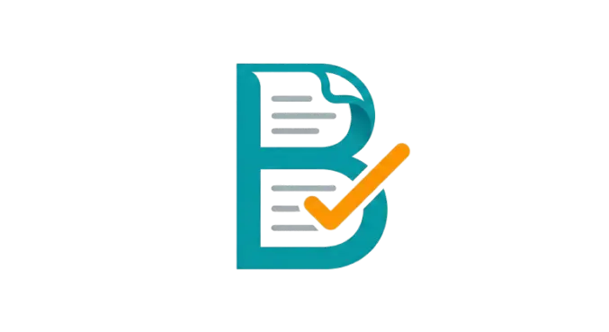

<p align="center">
  
</p>

<h1 align="center">Bill-y — Your Pakistani Utility Bill Expert</h1>

<p align="center">
  <em>Upload any Pakistani utility bill and get a complete plain-language explanation of every charge, why your bill changed, and what you can do about it — powered by Google Gemini AI.</em>
</p>

<p align="center">
  
  
  
  
  
</p>

---

## 🎯 The Problem

Pakistani utility bills — LESCO electricity, SNGPL gas, WASA water — are **confusing**. They're packed with cryptic charges like *FC Surcharge*, *QTA*, *FPA*, *DG Capacity*, and *GOP Tariff*. Most people just pay without understanding what they're paying for, whether they're being overcharged, or how they could save money.

**Bill-y fixes that.** Upload a photo of your bill and get instant, jargon-free answers.

---

## ✨ Features

### 📸 AI Bill Analysis
- Upload any Pakistani utility bill (LESCO, SNGPL, WASA, KWSB)
- Gemini 2.5 Flash extracts and explains **every line item** in plain language
- Every technical term gets an automatic parenthetical definition
- Anti-hallucination strict mode — never invents numbers or charges

### 📊 Rich Visual Dashboard
- **Bill Health Score** — A/B/C/F grade with conic gradient meter
- **Consumption Trend Charts** — 12-month history with Recharts
- **Charge Breakdown Pie Chart** — see where your money goes
- **Savings Meter & Usage Gauge** — track potential savings vs current usage
- **Billing Calendar** — visual timeline of due dates
- **Animated Numbers** — smooth easeOutQuart count-up animations

### 🆚 Bill Comparison
- Upload **two bills** side-by-side and see exactly what changed
- Major change detection with per-charge diff amounts
- Visual bar comparisons for amount, units, and cost-per-unit
- Solar performance comparison across billing periods

### 🌞 Solar / Net Metering Deep Dive
- Full solar performance metrics: export, import, net balance, credit
- Peak/off-peak breakdown with GOP tariff rates
- Quarterly settlement progress timeline
- Over-export warnings with actionable advice
- Mixed-solar detection when comparing a solar bill vs non-solar bill

### 💬 Conversational Chat (Streaming)
- Ask follow-up questions about your specific bill
- Streaming responses via server-sent text chunks
- Smart suggestion chips based on your bill's actual charges
- Context-aware — knows about your overdue status, solar data, warnings

### 📚 Knowledge Base (RAG)
- **3 official government documents** embedded with `gemini-embedding-2`:
  - NEPRA Consumer Service Manual 2025
  - Net Metering Guidelines for Consumers
  - NEPRA Prosumer Regulations (SRO 251/2026)
- HyDE (Hypothetical Document Embedding) for better retrieval
- Cosine similarity search with authoritative-first ranking
- Streaming answers with inline source citations `[1]`, `[2]`, etc.

### 📥 PDF Report Export
- Download a complete PDF summary of your bill analysis
- Generated client-side with jsPDF

### 🎨 Premium UI/UX
- Dark mode support with CSS custom properties
- Glassmorphism cards with backdrop blur
- Plus Jakarta Sans + JetBrains Mono typography
- Responsive mobile-first design with touch-friendly navigation
- Micro-animations and hover effects throughout

---

## 🛠️ Tech Stack

| Layer | Technology |
|-------|-----------|
| **AI Model** | [Gemini 2.5 Flash](https://ai.google.dev/) — bill analysis, chat, comparison, KB answers |
| **Embeddings** | [Gemini Embedding 2](https://ai.google.dev/) — 768-dim vectors for RAG retrieval |
| **Frontend** | React 19 + Vite 8 |
| **Charts** | Recharts |
| **PDF Export** | jsPDF |
| **Backend** | Express 5 (Node.js) |
| **File Upload** | Multer (memory storage, 10 MB limit) |
| **Rate Limiting** | express-rate-limit (100 req/15 min) |
| **Deployment** | Docker (multi-stage Node 22 Alpine) |

---

## 🚀 Getting Started

### Prerequisites

- **Node.js 22+**
- A **Google Gemini API key** — get one free at [ai.google.dev](https://ai.google.dev/)

### 1. Clone & Install

```bash
git clone https://github.com/Sinnan1/bill-y.git
cd bill-y
npm install
```

### 2. Set Environment Variables

Create a `.env` file in the project root:

```env
GEMINI_API_KEY=your_gemini_api_key_here
```

### 3. Run Development Server

```bash
# Start the Vite dev server (frontend)
npm run dev

# In a separate terminal — start the Express backend
npm start
```

The frontend runs on `http://localhost:5173` and the API server on `http://localhost:8080`.

### 4. Production Build

```bash
npm run build
npm start
```

The Express server serves the built Vite app from `dist/` and exposes all API endpoints.

---

## 🐳 Docker

```bash
docker build -t billy .
docker run -p 8080:8080 -e GEMINI_API_KEY=your_key billy
```

The multi-stage Dockerfile builds the React app, then runs a lean production image with only server dependencies.

---

## 📡 API Endpoints

| Method | Endpoint | Description |
|--------|----------|-------------|
| `POST` | `/api/analyze-bill` | Upload a bill image → get full JSON analysis |
| `POST` | `/api/compare-bills` | Upload two bill images → get comparison JSON |
| `POST` | `/api/chat` | Ask a question about an analyzed bill |
| `POST` | `/api/chat/stream` | Streaming version of chat (text/plain) |
| `POST` | `/api/kb/search` | Semantic search across embedded government docs |
| `POST` | `/api/kb/answer` | Streaming RAG answer with source citations |

---

## 📚 Adding Knowledge Base Documents

Use the embeddings generation script to add new PDFs to the RAG pipeline:

```bash
node scripts/generate-embeddings.js \
  --doc-id=my-document \
  --category=government \
  --name="My Document Name" \
  ./path/to/document.pdf
```

**Categories:** `government` (authoritative), `guide`, `faq`

The script automatically:
1. Extracts text from the PDF
2. Chunks it into ~1,200 character segments with 200-char overlap
3. Generates 768-dimensional embeddings via `gemini-embedding-2`
4. Saves to `public/embeddings/<doc-id>.json`
5. Updates `public/docs-registry.json`

---

## 📁 Project Structure

```
billy/
├── server.js                  # Express backend — all API routes & Gemini calls
├── src/
│   ├── App.jsx                # Main React app — all screens & components
│   ├── Charts.jsx             # Recharts visualizations (trends, gauges, calendar)
│   ├── KnowledgeBase.jsx      # RAG-powered document Q&A interface
│   ├── gemini.js              # Frontend API client (calls server endpoints)
│   ├── pdf.js                 # Client-side PDF report generation
│   ├── demoData.js            # Demo bill data for try-without-upload mode
│   ├── index.css              # Full design system — dark mode, animations, responsive
│   └── main.jsx               # React entry point
├── scripts/
│   └── generate-embeddings.js # PDF → embedding pipeline for Knowledge Base
├── public/
│   ├── docs-registry.json     # Knowledge Base document index
│   ├── embeddings/            # Pre-computed embedding vectors
│   ├── demo-bill.jpg          # Sample bill for demo mode
│   └── logo.webp              # App logo
├── Dockerfile                 # Multi-stage production build
├── package.json
└── vite.config.js
```

---

## 🏆 Built For

**AI Sekho 2026** — Google AI Competition

This project showcases three Google AI products working together:
1. **Gemini 2.5 Flash** — Multimodal bill analysis, chat, and comparison
2. **Gemini Vision** — OCR extraction from bill images
3. **Gemini Embedding 2** — Semantic search over official Pakistani utility regulations

---

## 📄 License

MIT

---

<p align="center">
  Made with ⚡ in Pakistan
</p>
